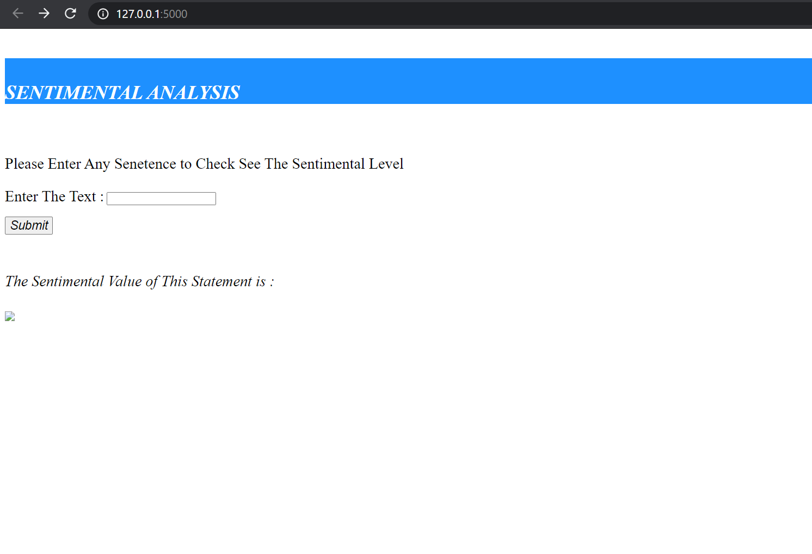
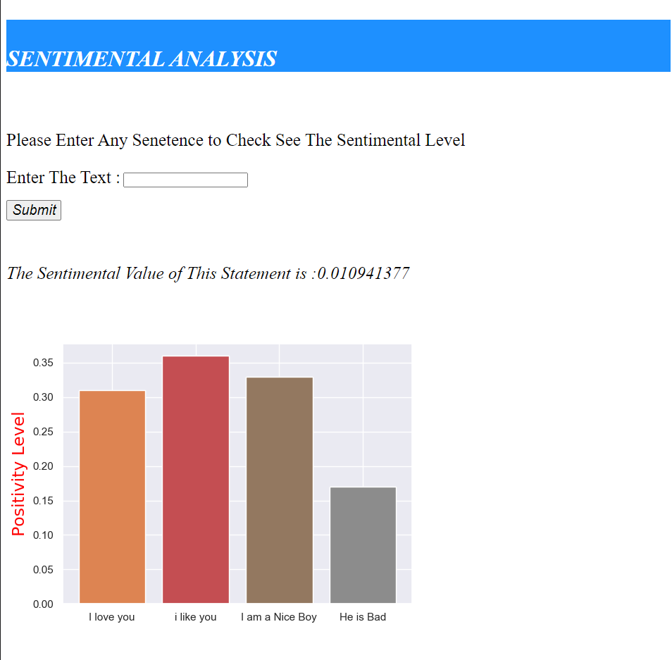

# Flask Project

 

This is my First Web Dev Project Using The Flask Framework.

### *About Flask*
***
 

 

>**Flask is a Micro Web Framework written in Python. It is Classified as a Micro-framework 
>because it does not require particular tools or Libraries. 
It has no database abstraction layer, form validation, or
> any other components where pre-existing third-party 
>libraries provide common Functions.**

 

To Know More About Flask [Click Here](https://opensource.com/article/18/4/flask)

 

### *ABOUT THIS REPOSITORY*
***
 

*Files*
* Main.py
* ML.py
* temp2.html

 

#### *WORKING*
***
I Have Trained a Model To Understand the Sentiments from a Given Sentences and 
Saved the Model in the File [New_NLP_MODEL2](New_NLP_MODEL2%20(1).h5) .
This Model Is Integrated With _**Flask Web_Frame**_.

 

We are Suppose to Write Any Sentence To the Web ,It then Tries to
Understand The Sentiment Behind that Sentence i.e Is it *Positive or Negative*
  
* It Then Displays a Value which Tells How Positive a Sentence is.
 
* It Also Gives a Graphical Representation Which Helps  in Comparing Different
Sentence 

### FRONT PAGE
***
 

  

### EXAMPLE 
***
 

  
***

The Above Image Shows The Way this Algorithm Works ,As we can
See How it is Differentiating Between Words *Like , Love ,Nice and Bad*.
The Heights of the Bar Tells us how positive the Sentences are.
 